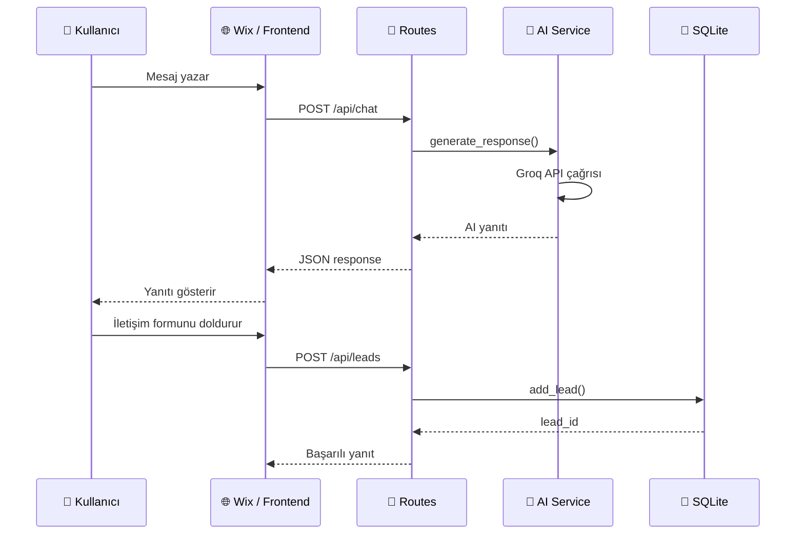

# 🧩 Muse AI Assistant

> Dijital pazarlama firmaları için yapay zeka destekli müşteri asistanı ve lead yönetim sistemi.

[](https://python.org)
[](https://flask.palletsprojects.com)
[](https://groq.com)
[](LICENSE)

---

## 📋 Proje Hakkında

**Muse AI Assistant**, dijital pazarlama ajanslarının web sitelerine entegre edilebilen, yapay zeka destekli bir sohbet asistanıdır. Potansiyel müşterilerle otomatik iletişim kurar, ihtiyaçlarını analiz eder ve iletişim bilgilerini (lead) güvenli şekilde kaydeder.

### ✨ Temel Özellikler

| Özellik | Açıklama |
|---------|----------|
| 🤖 **AI Sohbet** | Groq API üzerinden LLM destekli akıllı müşteri sohbeti |
| 📊 **Lead Yönetimi** | Potansiyel müşteri bilgilerini otomatik toplama ve saklama |
| 🌐 **Wix Entegrasyonu** | Wix Velo ile kolayca web sitesine gömülebilir chatbot widget |
| 🔒 **Güvenlik** | SQL Injection koruması, CORS yapılandırması, ortam değişkenleri ile gizli anahtar yönetimi |
| 🎭 **Demo Modu** | API anahtarı olmadan da test edilebilir fallback modu |

---

## 🏗️ Mimari

Proje, **Sorumlulukların Ayrılığı (Separation of Concerns)** ilkesine sıkı sıkıya bağlı bir mimariye sahiptir:

```
muse_ai_assistant/
├── run.py                 # Uygulama giriş noktası
├── config.py              # Tüm yapılandırma ayarları
├── requirements.txt       # Python bağımlılıkları
├── .env                   # Gizli anahtarlar (git'e dahil değil)
├── .gitignore             # Git dışı bırakılan dosyalar
└── app/
    ├── __init__.py        # Flask Application Factory
    ├── database.py        # Veritabanı işlemleri (SQL burada)
    ├── routes.py          # HTTP endpoint tanımları
    ├── services/
    │   ├── __init__.py
    │   └── ai_service.py  # Yapay zeka servisi (AI burada)
    └── templates/
        ├── index.html     # Ana sayfa + sohbet widget
        └── dashboard.html # Admin paneli (lead listesi)
```

### Veri Akışı



---

## 🚀 Kurulum

### Ön Gereksinimler

- **Python 3.10+**
- **pip** (Python paket yöneticisi)
- **Groq API Anahtarı** → [console.groq.com](https://console.groq.com) adresinden ücretsiz alabilirsiniz

### Adım Adım Kurulum

```bash
# 1. Repoyu klonlayın
git clone https://github.com/bilgeoztrk/muse_ai_assistant.git
cd muse_ai_assistant

# 2. Sanal ortam oluşturun
python3 -m venv venv
source venv/bin/activate        # macOS / Linux
# venv\Scripts\activate         # Windows

# 3. Bağımlılıkları yükleyin
pip install -r requirements.txt

# 4. Ortam değişkenlerini yapılandırın
cp .env.example .env
# .env dosyasını açıp GROQ_API_KEY değerini girin
```

### `.env` Dosyası Yapılandırması

```env
SECRET_KEY=güvenli-bir-anahtar-değeri
GROQ_API_KEY=gsk_xxxxxxxxxxxxxxxxxxxxx
GROQ_MODEL=qwen/qwen3.8-27b
DATABASE_URL=smartlead.db
FLASK_ENV=development
```

> **Not:** `GROQ_API_KEY` olmadan uygulama **demo modunda** çalışır — AI yanıtları yerine statik mesajlar döner.

---

## ▶️ Çalıştırma

### Geliştirme Modu

```bash
source venv/bin/activate
python run.py
```

Sunucu varsayılan olarak `http://localhost:5001` adresinde başlar.

### Prodüksiyon

```bash
gunicorn run:app --bind 0.0.0.0:8000 --workers 4
```

---

## 📡 API Referansı

### Sağlık Kontrolü

```http
GET /health
```

**Yanıt:**
```json
{
  "status": "healthy",
  "service": "Muse Puzzle"
}
```

---

### Sohbet

```http
POST /api/chat
Content-Type: application/json
```

**İstek:**
```json
{
  "message": "Merhaba, dijital pazarlama hizmetleriniz hakkında bilgi almak istiyorum.",
  "history": []
}
```

**Yanıt (200):**
```json
{
  "response": "Merhaba! Size yardımcı olmaktan mutluluk duyarım. Hangi dijital pazarlama alanında destek arıyorsunuz?"
}
```

---

### Lead Kayıt

```http
POST /api/leads
Content-Type: application/json
```

**İstek:**
```json
{
  "name": "Bilge Öztürk",
  "phone": "+90 555 123 4567",
  "message": "SEO danışmanlığı hakkında bilgi almak istiyorum."
}
```

**Yanıt (201):**
```json
{
  "success": true,
  "lead_id": 1
}
```

---

### Lead Listeleme

```http
GET /api/leads
```

**Yanıt (200):**
```json
{
  "leads": [
    {
      "id": 1,
      "name": "Bilge Öztürk",
      "phone": "+90 555 123 4567",
      "message": "SEO danışmanlığı hakkında bilgi almak istiyorum.",
      "created_at": "2026-09-20 19:30:00"
    }
  ],
  "count": 1
}
```

---

## 🧪 Test

```bash
# Sağlık kontrolü
curl http://localhost:5001/health

# Sohbet testi
curl -X POST http://localhost:5001/api/chat \
  -H "Content-Type: application/json" \
  -d '{"message": "Merhaba!", "history": []}'

# Lead kayıt testi
curl -X POST http://localhost:5001/api/leads \
  -H "Content-Type: application/json" \
  -d '{"name": "Test Kullanıcı", "phone": "05551234567", "message": "Test mesajı"}'

# Lead listeleme
curl http://localhost:5001/api/leads
```

---

## 🛡️ Güvenlik

| Tehdit | Korunma Yöntemi |
|--------|----------------|
| SQL Injection | Parametreli sorgular (`?` placeholder) |
| XSS Saldırısı | `escapeHtml()` fonksiyonu ile çıktı temizleme |
| Hassas Veri Sızıntısı | `.env` dosyası `.gitignore` ile korunur |
| CORS Suistimali | Flask-CORS yapılandırması |
| API Key Sızıntısı | Ortam değişkenleri ile anahtar yönetimi |

---

## 🛠️ Teknoloji Yığını

- **Backend:** Flask 3.1 (Python)
- **Veritabanı:** SQLite3
- **AI/LLM:** Groq API (Qwen 3.8-27B)
- **Frontend:** HTML5, CSS3, Vanilla JavaScript
- **Sunucu:** Gunicorn (prodüksiyon)
- **Entegrasyon:** Wix Velo (frontend widget)

---

## 📁 Dosya Sorumlulukları

| Dosya | Sorumluluk | Kural |
|-------|-----------|-------|
| `config.py` | Yapılandırma yönetimi | Gizli anahtarlar **sadece** burada |
| `database.py` | Veritabanı işlemleri | SQL kodu **sadece** burada |
| `ai_service.py` | AI/LLM etkileşimleri | AI kodu **sadece** burada |
| `routes.py` | HTTP yönlendirme | İş mantığı **yok**, sadece delege eder |
| `__init__.py` | Uygulama montajı | Factory Pattern ile bileşenleri birleştirir |

---

## 🗺️ Yol Haritası

- [x] MVP Backend (Flask + SQLite + Groq AI)
- [x] REST API Endpoint'leri (Chat, Lead CRUD)
- [x] Demo Modu (API anahtarı olmadan çalışma)
- [ ] Wix Velo Frontend Entegrasyonu
- [ ] Admin Dashboard Geliştirmeleri
- [ ] Gelişmiş Sohbet Geçmişi Yönetimi
- [ ] Çoklu Dil Desteği
- [ ] Analytics ve Raporlama

---

## 📄 Lisans

Bu proje [MIT Lisansı](LICENSE) ile lisanslanmıştır.

---

<p align="center">
  <b>Muse Puzzle</b> · Dijital Pazarlama AI Asistanı
  <br>
  <sub>Built with ❤️ by <a href="https://github.com/bilgeoztrk">bilgeoztrk</a></sub>
</p>
