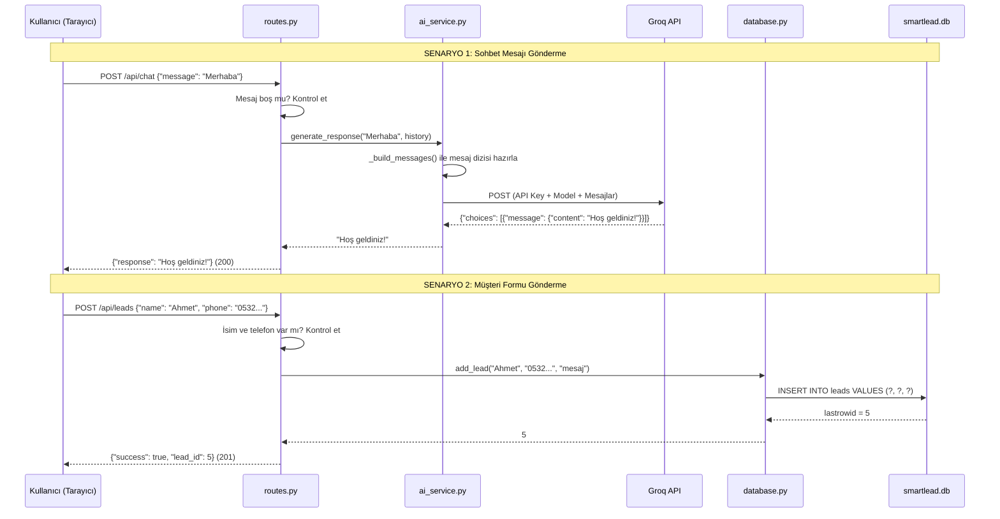

# SmartLead AI (Muse Puzzle) — Tam Proje Analiz Dokümanı

> **Hedef Kitle:** Junior geliştirici, sıfırdan öğrenen biri.
> **Proje Adı:** SmartLead AI / Muse Puzzle
> **Ne Yapar:** Dijital pazarlama firması için yapay zeka destekli müşteri sohbet asistanı ve potansiyel müşteri (lead) kayıt sistemi.

---

## 📐 1. Mimari: "Sorumlulukların Ayrılığı" (Separation of Concerns)

Bu projenin **temel felsefesi** şudur: **Her dosya yalnızca bir işten sorumludur.**

Bunu bir restoran benzetmesiyle anlayalım:

| Restoran Rolü | Proje Karşılığı | Dosya |
| :--- | :--- | :--- |
| **Garson** (siparişi alır, mutfağa iletir, yemeği müşteriye getirir) | HTTP isteklerini karşılayıp ilgili servise yönlendirir | `routes.py` |
| **Şef** (yemeği pişirir, tarife göre hazırlar) | Yapay zeka API'sine istek atar, yanıtı alır | `ai_service.py` |
| **Depocu** (malzemeleri depoya koyar, çıkarır, sayar) | Veritabanına kayıt ekler, okur | `database.py` |
| **Restoran Müdürü** (herkesin görevini belirler, restoranı açar) | Uygulamayı bir araya getirir, başlatır | `__init__.py` |
| **Ayarlar Dosyası** (menü, çalışma saatleri, tedarikçi numaraları) | API anahtarları, veritabanı yolu, ortam değişkenleri | `config.py` + `.env` |

> [!IMPORTANT]
> Bu projede SQL kodu **SADECE** `database.py` dosyasında, yapay zeka kodu **SADECE** `ai_service.py` dosyasında yer alır. `routes.py` dosyası hiçbir zaman doğrudan veritabanıyla veya AI API'siyle konuşmaz — her zaman aracı (garson) rolündedir.

---

## 🗂️ 2. Dosya Yapısı ve Hiyerarşi

```text
smartlead_ai/
├── run.py                    ← 🚀 Uygulamayı başlatan dosya (giriş noktası)
├── config.py                 ← ⚙️ Tüm ayarlar ve gizli anahtarlar
├── requirements.txt          ← 📦 Python kütüphane listesi
├── .env                      ← 🔐 Gizli çevre değişkenleri (API anahtarı vb.)
├── .gitignore                ← 🛡️ Git'e yüklenmemesi gereken dosyalar
├── smartlead.db              ← 💾 SQLite veritabanı dosyası (otomatik oluşur)
│
└── app/                      ← 📁 Ana uygulama paketi
    ├── __init__.py            ← 🏭 Uygulama Fabrikası (her şeyi bir araya getirir)
    ├── database.py            ← 🗄️ Veritabanı işlemleri (SQL SADECE BURADA)
    ├── routes.py              ← 🚦 HTTP rotaları (URL yönlendirmeleri)
    │
    ├── services/              ← 📁 İş mantığı servisleri
    │   ├── __init__.py        ← (Paket tanımlayıcı, boş)
    │   └── ai_service.py      ← 🤖 Yapay zeka servisi (AI KODU SADECE BURADA)
    │
    └── templates/             ← 📁 HTML şablonları (yerel test arayüzü)
        ├── index.html         ← 🏠 Ana sayfa (sohbet + iletişim formu)
        └── dashboard.html     ← 📊 Yönetim paneli (lead listesi)
```

---

## 📄 3. Dosya Dosya Detaylı Açıklamalar

### 3.1 `run.py` — Giriş Noktası (Kapıyı Açan Anahtar)

**Dosya:** [`run.py`](file:///Users/burakpabuccu/Desktop/smartlead_ai/run.py)
**Satır Sayısı:** 17
**Görevi:** Uygulamayı başlatmak. Terminalde `python run.py` yazdığınızda çalışan ilk dosyadır.

```python
from app import create_app
import os

config_name = os.environ.get("FLASK_ENV", "development")
app = create_app(config_name)

if __name__ == "__main__":
    app.run(debug=True, host="0.0.0.0", port=5001)
```

**Satır satır ne olur:**
1. `create_app()` fonksiyonunu çağırarak tüm uygulamayı hazırlar (veritabanını kurar, rotaları yükler vb.).
2. `.env` dosyasındaki `FLASK_ENV` değerine bakarak ortamı belirler (`development` veya `production`).
3. `host="0.0.0.0"`: Sadece bilgisayarınızdan değil, aynı ağdaki diğer cihazlardan da erişilebilir olmasını sağlar.
4. `port=5001`: Sunucu 5001 numaralı portta ayağa kalkar.
5. `if __name__ == "__main__"`: Bu dosya doğrudan çalıştırıldığında devreye girer. `gunicorn run:app` ile çalıştırıldığında bu blok atlanır (Gunicorn kendi yönetir).

**Üretim (production) ortamı için:** `gunicorn run:app` komutu kullanılır. Gunicorn, `app` değişkenini doğrudan bu dosyadan alır.

---

### 3.2 `config.py` — Merkezi Yapılandırma (Ayarlar Merkezi)

**Dosya:** [`config.py`](file:///Users/burakpabuccu/Desktop/smartlead_ai/config.py)
**Satır Sayısı:** 61
**Görevi:** Tüm API anahtarlarını, veritabanı adresini ve yapay zekanın kişiliğini tek bir dosyadan yönetmek.

**Neden önemli?** API anahtarını 10 farklı dosyaya yazmak yerine, tek buraya yazarsınız. Değiştirmeniz gerektiğinde sadece buraya bakarsınız.

#### Yapı:

```
Config (Ana Sınıf)
  ├── DevelopmentConfig → DEBUG = True  (yerel geliştirme)
  └── ProductionConfig  → DEBUG = False (canlı sunucu)
```

**Temel Ayarlar:**

| Ayar | Nereden Gelir | Ne İşe Yarar |
| :--- | :--- | :--- |
| `SECRET_KEY` | `.env` dosyası | Flask'ın oturum (session) şifrelemesi için kullandığı gizli anahtar |
| `DATABASE_URL` | `.env` dosyası | SQLite veritabanı dosyasının adı (`smartlead.db`) |
| `GROQ_API_KEY` | `.env` dosyası | Groq yapay zeka servisine erişim anahtarı |
| `GROQ_MODEL` | `.env` veya varsayılan | Kullanılacak LLM modeli (`qwen/qwen3.8-27b`) |
| `GROQ_API_URL` | Varsayılan | Groq API'nin adresi |
| `BUSINESS_CONTEXT` | Doğrudan kodda | Yapay zekanın kişiliği ve kuralları (system prompt) |

**`BUSINESS_CONTEXT` Nedir?**
Yapay zekaya "Sen kimsin, nasıl davranmalısın?" diye verilen talimattır (system prompt). Bu sayede AI, Muse Puzzle'ın dijital pazarlama danışmanı gibi davranır, Türkçe yanıt verir ve müşteriden iletişim bilgisi istemeye teşvik eder.

---

### 3.3 `.env` — Gizli Çevre Değişkenleri (Kasa)

**Dosya:** [`.env`](file:///Users/burakpabuccu/Desktop/smartlead_ai/.env)
**Görevi:** API anahtarları gibi gizli bilgileri saklamak.

```text
SECRET_KEY=your-secret-key-change-this
FLASK_ENV=development
GROQ_API_KEY=gsk_xxxxx...
DATABASE_URL=smartlead.db
```

> [!CAUTION]
> Bu dosya `.gitignore` içinde tanımlıdır ve GitHub'a **KESİNLİKLE** yüklenmez. API anahtarınız GitHub'a sızarsa, başkaları sizin adınıza API kullanabilir ve ücret ödemenize neden olabilir.

---

### 3.4 `app/__init__.py` — Uygulama Fabrikası (Montaj Hattı)

**Dosya:** [`app/__init__.py`](file:///Users/burakpabuccu/Desktop/smartlead_ai/app/__init__.py)
**Satır Sayısı:** 52
**Görevi:** Tüm parçaları (config, database, CORS, routes) bir araya getirip çalışır bir Flask uygulaması üretmek.

**"Factory Pattern" (Fabrika Deseni) nedir?**
`create_app()` fonksiyonu her çağrıldığında sıfırdan yeni bir Flask uygulaması oluşturur. Buna "Application Factory" denir. Avantajı: test ortamı için farklı, canlı ortam için farklı ayarlarla uygulama üretebilirsiniz.

**`create_app()` fonksiyonu sırasıyla şunları yapar:**

```
1. Flask(__name__)           → Boş bir Flask uygulaması oluşturur
2. app.config.from_object()  → config.py'den ayarları yükler
3. CORS(app)                 → Farklı alan adlarından (Wix) gelen isteklere izin verir
4. init_db(app)              → Veritabanını başlatır (tablo yoksa oluşturur)
5. register_blueprint()      → Sayfa ve API rotalarını kaydeder
6. /health endpoint          → Sunucunun ayakta olup olmadığını kontrol eden uç nokta
```

**CORS Nedir ve Neden Lazım?**
Normalde bir tarayıcı, `wix.com` üzerinden `smartlead-api.onrender.com`'a istek göndermeye çalışırsa güvenlik nedeniyle engellenir. CORS (Cross-Origin Resource Sharing), "bu adreslerden gelen isteklere izin ver" demektir. Wix entegrasyonu için zorunludur.

---

### 3.5 `app/database.py` — Veritabanı Katmanı (Depo)

**Dosya:** [`app/database.py`](file:///Users/burakpabuccu/Desktop/smartlead_ai/app/database.py)
**Satır Sayısı:** 106
**Görevi:** Tüm veritabanı okuma/yazma işlemlerini yapmak. Projede SQL kodu yalnızca bu dosyada bulunur.

#### Fonksiyonlar:

| Fonksiyon | Satır | Ne Yapar | Benzetme |
| :--- | :---: | :--- | :--- |
| `get_db()` | [13-25](file:///Users/burakpabuccu/Desktop/smartlead_ai/app/database.py#L13-L25) | Veritabanına bağlantı açar. Aynı istek içinde tekrar çağrılırsa mevcut bağlantıyı döndürür | Depo kapısının anahtarı |
| `close_db()` | [28-35](file:///Users/burakpabuccu/Desktop/smartlead_ai/app/database.py#L28-L35) | İstek bittiğinde bağlantıyı kapatır (bellek sızıntısını önler) | Kapıyı kilitleme |
| `init_db(app)` | [38-59](file:///Users/burakpabuccu/Desktop/smartlead_ai/app/database.py#L38-L59) | `leads` tablosunu oluşturur (yoksa). Uygulama başlarken bir kez çalışır | Depoyu ilk kez kurma |
| `add_lead()` | [62-81](file:///Users/burakpabuccu/Desktop/smartlead_ai/app/database.py#L62-L81) | Yeni müşteri kaydı ekler | Depoya yeni ürün koyma |
| `get_all_leads()` | [84-105](file:///Users/burakpabuccu/Desktop/smartlead_ai/app/database.py#L84-L105) | Tüm müşteri kayıtlarını en yeniden eskiye sıralı getirir | Tüm ürünleri listeleme |

#### Veritabanı Tablosu Şeması (`leads`):

| Sütun | Veri Tipi | Açıklama | Kısıtlama |
| :--- | :--- | :--- | :--- |
| `id` | INTEGER | Benzersiz kayıt numarası | Otomatik artar (1, 2, 3...) |
| `name` | TEXT | Müşterinin adı soyadı | Boş bırakılamaz (`NOT NULL`) |
| `phone` | TEXT | Telefon numarası | Boş bırakılamaz (`NOT NULL`) |
| `message` | TEXT | Müşterinin mesajı/talebi | Boş bırakılabilir |
| `created_at` | TIMESTAMP | Kayıt oluşturulma tarihi | Otomatik eklenir |

> [!IMPORTANT]
> **SQL Injection Koruması:** Kayıt eklerken `f"INSERT INTO leads VALUES ('{name}')"` gibi **TEHLİKELİ** string birleştirme kullanılmaz. Bunun yerine parametreli sorgular (`?` yer tutucusu) kullanılır:
> ```python
> db.execute("INSERT INTO leads (name, phone, message) VALUES (?, ?, ?)", (name, phone, message))
> ```
> Bu sayede kullanıcı mesaj alanına `'; DROP TABLE leads; --` gibi kötü niyetli kod yazsa bile, veritabanı bunu düz metin olarak kaydeder ve tablonuz güvende kalır.

#### Flask `g` Nesnesi Nedir?
`g`, Flask'ta her HTTP isteği için oluşturulan geçici bir depolama alanıdır. Veritabanı bağlantısını `g.db`'ye koyarak, aynı istek içinde birden fazla veritabanı sorgusu yapılsa bile tek bir bağlantı kullanılmasını sağlarız. İstek bittiğinde `close_db()` otomatik olarak bu bağlantıyı kapatır.

---

### 3.6 `app/services/ai_service.py` — Yapay Zeka Servisi (Beyin)

**Dosya:** [`app/services/ai_service.py`](file:///Users/burakpabuccu/Desktop/smartlead_ai/app/services/ai_service.py)
**Satır Sayısı:** 147
**Görevi:** Groq API üzerinden yapay zekadan yanıt almak. Projede AI kodu yalnızca bu dosyada bulunur.

#### Sınıflar ve Metotlar:

**`AIServiceError`** (Özel Hata Sınıfı):
Python'ın yerleşik `Exception` sınıfından türetilmiştir. AI ile ilgili herhangi bir hata (bağlantı kesintisi, zaman aşımı, geçersiz yanıt) bu özel hata sınıfıyla fırlatılır. Böylece `routes.py` dosyasında `except AIServiceError` yazarak sadece AI hatalarını yakalayabilir ve kullanıcıya uygun mesaj döndürebiliriz.

**`AIService` Sınıfı:**

| Metot | Satır | Ne Yapar |
| :--- | :---: | :--- |
| `__init__()` | [26-33](file:///Users/burakpabuccu/Desktop/smartlead_ai/app/services/ai_service.py#L26-L33) | Flask config'den API anahtarı, model adı, API URL'si ve işletme bağlamını alır |
| `generate_response()` | [35-99](file:///Users/burakpabuccu/Desktop/smartlead_ai/app/services/ai_service.py#L35-L99) | Ana fonksiyon: mesajı ve sohbet geçmişini alır, Groq API'ye gönderir, yanıtı döndürür |
| `_build_messages()` | [101-130](file:///Users/burakpabuccu/Desktop/smartlead_ai/app/services/ai_service.py#L101-L130) | API'ye gönderilecek mesaj dizisini hazırlar (sistem talimatı + geçmiş + yeni mesaj) |
| `_demo_response()` | [132-146](file:///Users/burakpabuccu/Desktop/smartlead_ai/app/services/ai_service.py#L132-L146) | API anahtarı yoksa çökmek yerine kullanıcıya güvenli bir demo mesajı döndürür |

#### Groq API'ye Gönderilen İstek Yapısı:

```json
{
  "model": "qwen/qwen3.8-27b",
  "messages": [
    {"role": "system",    "content": "Sen Muse Puzzle danışmanısın..."},
    {"role": "user",      "content": "Önceki mesaj 1"},
    {"role": "assistant", "content": "AI'ın önceki yanıtı"},
    {"role": "user",      "content": "Şu anki yeni mesaj"}
  ],
  "temperature": 0.7,
  "max_tokens": 300
}
```

- **`system`**: Yapay zekaya verilen gizli talimat (kullanıcı bunu görmez).
- **`user`**: Kullanıcının yazdığı mesajlar.
- **`assistant`**: Yapay zekanın daha önce verdiği yanıtlar.
- **`temperature`**: Yaratıcılık seviyesi (0 = çok robotik, 1 = çok yaratıcı, 0.7 = dengeli).
- **`max_tokens`**: Yanıtın maksimum uzunluğu (~300 kelime).

#### Hata Yönetimi:

| Hata Türü | Ne Zaman Olur | Kullanıcıya Dönen Mesaj |
| :--- | :--- | :--- |
| `Timeout` | Groq 30 saniye içinde yanıt vermezse | "AI servisi yanıt vermedi. Lütfen tekrar deneyin." |
| `ConnectionError` | İnternet bağlantısı yoksa | "AI servisine bağlanılamadı." |
| `HTTPError` | API anahtarı geçersiz, model bulunamazsa (404, 401 vb.) | "AI servisi hata döndürdü: {status_code}" |
| `KeyError/IndexError` | API beklenmeyen formatta yanıt verirse | "AI servisinden beklenmeyen bir yanıt alındı." |

---

### 3.7 `app/routes.py` — Yönlendirici (Trafik Polisi)

**Dosya:** [`app/routes.py`](file:///Users/burakpabuccu/Desktop/smartlead_ai/app/routes.py)
**Satır Sayısı:** 117
**Görevi:** HTTP isteklerini karşılamak, doğrulamak, ilgili servise yönlendirmek ve yanıtı biçimlendirip geri döndürmek.

> [!NOTE]
> Bu dosyada SQL kodu veya AI kodu yoktur. Sadece "al → kontrol et → ilgili servise gönder → sonucu döndür" mantığı vardır.

#### Blueprint Nedir?
Flask'ta rotaları (URL'leri) gruplamak için kullanılan bir yapıdır. Bu projede iki ayrı Blueprint vardır:

| Blueprint | Değişken Adı | URL Ön Eki | Görevi |
| :--- | :--- | :--- | :--- |
| Sayfa Rotaları | `pages_bp` | *(yok)* | HTML sayfalarını sunar |
| API Rotaları | `api_bp` | `/api` | JSON veri alışverişi yapar |

#### Tüm URL Uç Noktaları (Endpoints):

| HTTP Metodu | URL | Fonksiyon | Ne Yapar | Başarı Kodu |
| :--- | :--- | :--- | :--- | :---: |
| `GET` | `/` | `index()` | Ana sayfayı (sohbet + form) gösterir | 200 |
| `GET` | `/dashboard` | `dashboard()` | Yönetim panelini gösterir | 200 |
| `POST` | `/api/chat` | `chat()` | Mesajı alır → AI'a gönderir → yanıtı döner | 200 |
| `POST` | `/api/leads` | `create_lead()` | Form verilerini alır → veritabanına kaydeder | 201 |
| `GET` | `/api/leads` | `list_leads()` | Tüm müşteri kayıtlarını JSON listesi olarak döner | 200 |
| `GET` | `/health` | `health()` | Sunucunun ayakta olduğunu bildirir (monitoring) | 200 |

#### HTTP Durum Kodları ve Anlamları:

| Kod | Anlam | Ne Zaman Döner |
| :---: | :--- | :--- |
| `200` | ✅ Başarılı | Normal okuma/yanıt işlemleri |
| `201` | ✅ Oluşturuldu | Yeni lead kaydı başarıyla eklendi |
| `400` | ❌ Hatalı İstek | Zorunlu alan eksik (isim/telefon/mesaj boş) |
| `500` | ❌ Sunucu Hatası | Beklenmeyen bir hata oluştu |
| `503` | ❌ Servis Kullanılamıyor | AI servisi yanıt veremedi |

---

### 3.8 `app/templates/` — HTML Şablonları (Yerel Test Arayüzü)

#### [`index.html`](file:///Users/burakpabuccu/Desktop/smartlead_ai/app/templates/index.html) — Ana Sayfa
- Sol taraf: AI ile sohbet penceresi (mesaj gönder, yanıt al)
- Sağ taraf: Müşteri bilgi formu (ad, telefon, mesaj)
- JavaScript ile `/api/chat` ve `/api/leads` endpointlerine `fetch()` istekleri gönderir
- Glassmorphism (buzlu cam efekti) ile modern, koyu temalı tasarım

#### [`dashboard.html`](file:///Users/burakpabuccu/Desktop/smartlead_ai/app/templates/dashboard.html) — Yönetim Paneli
- İstatistik kartları: Toplam lead, bugün gelen, bu hafta gelen
- Müşteri kayıtlarının tablo halinde listelenmesi
- `/api/leads` endpointinden `fetch()` ile verileri çeker
- XSS (Cross-Site Scripting) koruması için `escapeHtml()` fonksiyonu kullanır

> [!NOTE]
> Bu HTML dosyaları Wix entegrasyonu öncesinde **yerel geliştirme ve test** amacıyla oluşturulmuştur. Canlı ortamda arayüz Wix Velo üzerinden sağlanacaktır.

---

### 3.9 `requirements.txt` — Bağımlılık Listesi

**Dosya:** [`requirements.txt`](file:///Users/burakpabuccu/Desktop/smartlead_ai/requirements.txt)

| Kütüphane | Sürüm | Ne İşe Yarar |
| :--- | :--- | :--- |
| `Flask` | 3.1.1 | Python web framework'ü (sunucu, rota yönetimi, şablon motoru) |
| `requests` | 2.32.3 | Groq API'ye HTTP istekleri göndermek için |
| `python-dotenv` | 1.1.0 | `.env` dosyasını okuyup çevre değişkenlerine yüklemek için |
| `flask-cors` | 5.0.1 | Wix gibi farklı alan adlarından gelen isteklere izin vermek için (CORS) |
| `gunicorn` | 23.0.0 | Üretim ortamında Flask'ı çalıştıran profesyonel WSGI sunucusu |

**Kurulum:** `pip install -r requirements.txt`

---

### 3.10 `.gitignore` — Git Güvenlik Filtreleri

**Dosya:** [`.gitignore`](file:///Users/burakpabuccu/Desktop/smartlead_ai/.gitignore)

Bu dosya, Git'e "şu dosya ve klasörleri takip etme, GitHub'a yükleme" der.

| Dışlanan Öğe | Neden Dışlanıyor |
| :--- | :--- |
| `.env` | 🔐 API anahtarı ve gizli bilgiler içerir |
| `venv/` | 📦 Sanal ortam (~50MB), her bilgisayarda `pip install` ile tekrar kurulur |
| `*.db` | 💾 Veritabanı dosyası, her ortamda kendi verisi oluşur |
| `__pycache__/` | ⚡ Python'un otomatik oluşturduğu derlenmiş dosyalar |
| `.DS_Store` | 🍎 macOS'un otomatik oluşturduğu klasör meta verisi |

---

## 🔄 4. Veri Akış Diyagramı

Bir kullanıcının mesaj gönderdiğinde arka planda neler olduğu:



---

## 🛡️ 5. Güvenlik Önlemleri

| Tehdit | Korunma Yöntemi | Nerede Uygulanıyor |
| :--- | :--- | :--- |
| **SQL Injection** | Parametreli sorgular (`?` yer tutucusu) | [`database.py:L77`](file:///Users/burakpabuccu/Desktop/smartlead_ai/app/database.py#L77) |
| **API Anahtarı Sızıntısı** | `.env` dosyası + `.gitignore` koruması | [`.gitignore:L12`](file:///Users/burakpabuccu/Desktop/smartlead_ai/.gitignore#L12) |
| **XSS (Cross-Site Scripting)** | HTML escape fonksiyonu | [`dashboard.html:L360`](file:///Users/burakpabuccu/Desktop/smartlead_ai/app/templates/dashboard.html#L360) |
| **Debug Bilgi Sızıntısı** | Production'da `DEBUG = False` | [`config.py:L51`](file:///Users/burakpabuccu/Desktop/smartlead_ai/config.py#L51) |
| **API Çökmesi** | Demo mod fallback + try/except | [`ai_service.py:L54`](file:///Users/burakpabuccu/Desktop/smartlead_ai/app/services/ai_service.py#L54) |
| **CORS Kısıtlaması** | flask-cors ile kontrollü erişim | [`__init__.py:L34`](file:///Users/burakpabuccu/Desktop/smartlead_ai/app/__init__.py#L34) |

---

## 🧪 6. Projeyi Test Etme Rehberi

### Terminalden Hızlı Testler:

```bash
# 1. Sunucuyu başlat
source venv/bin/activate
python run.py

# 2. Sağlık kontrolü
curl http://localhost:5001/health

# 3. AI sohbet testi
curl -X POST http://localhost:5001/api/chat \
  -H "Content-Type: application/json" \
  -d '{"message": "Merhaba, dijital pazarlama hizmeti alabilir miyim?"}'

# 4. Müşteri kaydı ekleme
curl -X POST http://localhost:5001/api/leads \
  -H "Content-Type: application/json" \
  -d '{"name": "Test Müşteri", "phone": "0555-123-4567", "message": "Bilgi istiyorum"}'

# 5. Müşteri kayıtlarını listeleme
curl http://localhost:5001/api/leads

# 6. Veritabanını doğrudan inceleme
sqlite3 smartlead.db -column -header "SELECT * FROM leads;"
```

---

## 📊 7. Proje İstatistikleri

| Metrik | Değer |
| :--- | :--- |
| Toplam Python Dosyası | 6 |
| Toplam HTML Şablonu | 2 |
| Toplam Python Satırı (boşluklar dahil) | ~343 |
| Kullanılan Dış Kütüphane | 5 |
| API Endpoint Sayısı | 5 (`/`, `/dashboard`, `/api/chat`, `/api/leads` POST, `/api/leads` GET, `/health`) |
| Veritabanı Tablosu | 1 (`leads`) |
| Mimari Desen | Application Factory + Separation of Concerns |

---

## 🗺️ 8. Sonraki Adımlar (Kalan İşler)

1. **Git & GitHub:** Projeyi versiyon kontrolüne almak
2. **Render.com:** Backend'i canlı ortama yayınlamak
3. **Wix Velo:** Frontend'i Wix üzerinde oluşturup canlı API'ye bağlamak
4. **README.md:** Proje dökümantasyonunu yazmak
5. **Son Testler:** Canlı ortamda uçtan uca doğrulama
